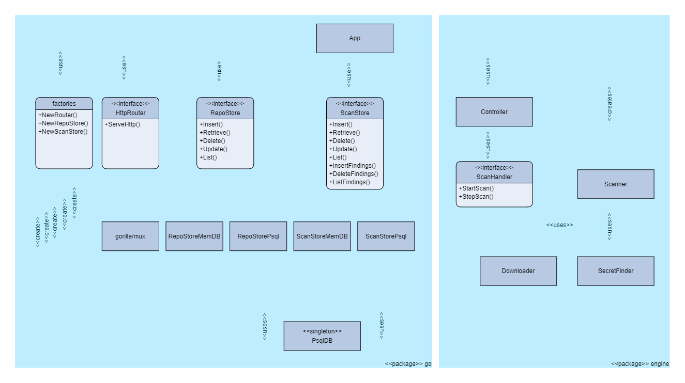

# Repository Scanner

This repository implements a basic static application security scan (SAST) service. It is able to scan public repositories accessible via http/https and report security issues. It is programming language agnostic.

The current implementation only attempts to find possible secrets committed to the repository by looking for the `private_key` and `public_key` keywords.

## Getting Started

### Prerequisites

#### Containerized

* Docker

#### On host

* Go (1.18 or higher)
* Postgresql

### Running the service

#### .env file configuration

Define the following environment variables in the `.env` file at the root of the repository.

```env
DATABASE_TYPE=postgresql
DATABASE_HOST=db
DATABASE_PORT=5432
DATABASE_USER=<your username>
DATABASE_PASSWORD=<your password>
DATABASE_NAME=<your database name>
```

* `DATABASE_TYPE` **must** be set to postgresql except during testing.
* `DATABASE_HOST` **should** be set to `db` if running containerized

#### Containerized

After cloning the repository, set your database password in `docker/db/password.txt`.

Then run the following at the repository root:

```bash
# docker compose build
# docker compose up -d
```

This starts three containers for the reverse proxy (nginx), db (postgresql), and backend (go application).

#### On host

After cloning the repository, run the following at the repository root:

```bash
# go get
# go build
# go install
# reposcanner
```

After the above steps, the service should be running and accessible via `tcp/8080`.

It is recommended configure a reverse proxy in front of the service for stability when running under load.

## API Reference

The current API version is `0.0.1`.

The complete API specification is available in [this swagger specification](docs/api/swagger.yaml).

Four endpoints are provided:

* `/<version>/repository` - allows CRUD operations on repositories, as well as creating new scans. Supports POST, GET, PUT, and DELETE methods.
* `/<version>/repositories` - allows retrieving a paginated list of all repositories. Supports GET.
* `/<version>/scan/{id}` - allows RD operations on scans, including the scan results. Supports GET and DELETE methods.
* `/<version>/scans` - allows retrieving a paginated list of all scans. Supports GET.

The repository endpoints work mostly with the `RepositoryRecord` model.

```json
{
    "id": 1,
    "info": {
        "name": "repo name",
        "url": "https://example.com/repo",
        "branch": "main"
    }
}
```

The scan endpoints work mostly with the `ScanRecord` model.

```json
{
    "id": "AqAAAAAAAAA",
    "info": {
        "repoid": 1,
        "queuedAt": "2022-01-01T00:00:00+03:00",
        "scanningAt": "2022-01-01T00:00:01+03:00",
        "finishedAt": "2022-01-01T00:00:10+03:00",
        "status": "SUCCESS"
    }
}
```

## Testing

### Unit Testing

The code includes unit tests to verify most core functionality. These tests can be executed on host or containerized depending on the requirements.

#### go/.env_test file configuration

Define the following environment variables in the `.env_test` file inside the `go` subdirectory.

```env
ENGINE_NOOP=1
DATABASE_TYPE=postgresql
DATABASE_HOST=db
DATABASE_PORT=5432
DATABASE_USER=<your username>
DATABASE_PASSWORD=<your password>
DATABASE_NAME=<your database name>
```

* `ENGINE_NOOP` controls whether the scan engine performs a real repository scan. If set to `1` the scan engine will not download and scan any repository provided and will only return dummy results.
* `DATABASE_TYPE` controls whether the tests will use a real postgresql database or use an in-memory database (go-memdb). If set to `postgresql` a real database will be used. Tests execute much faster when running in-memory.
* `DATABASE_HOST` **should** be set to `db` if running containerized and using the real database.

#### Containerized

Run the following at the repository root:

```bash
# docker compose -f compose_test.yaml build
# docker compose -f compose_test.yaml up
```

#### On host

Run the following at the repository root:

```bash
# go test -v -coverprofile=coverage.out ./engine ./go
# go tool cover -html=coverage.out
```

### Functional Testing

For functional testing a [Postman](https://www.postman.com/) collection is available in the [postman directory](postman). The collection currently contains only basic API requests and have to be executed manually.

## Design Reference

### Architecture

The service is designed as shown below.



* The REST APIs for all endpoints are implemented in `App`.
* `gorilla/mux` is used as the router backend, since it's stable and well-utilised in a lot of projects.
* At runtime, `HttpRouter` provides the main execution loop for handling API requests. `Controller` also has its own independent execution loop for processing scan requests.
* When a scan is triggered, App will submit a `Job` to `Controller` and starts a goroutine to process any feedback from the `Job`. Each `Job` contains its own results channel where feedback will be sent back. This goroutine updates the database based on the feedback, and terminates once the scan is completed.
* `Controller` continuously monitors its `Job` queue. When a new `Job` arrives, it forwards it to `Scanner` which starts a goroutine for performing the scan.
* There is a limit to the number of concurrent scans that `Scanner` will allow. The goroutines for processing new scans will block until previously executing scans are completed.
* `Scanner` sends updates and findings through the results channel contained in each `Job`.
* All data models were initially generated by Swagger codegen from the Swagger API documentation, then modified as needed.
* Initial implementation was done without the use of a postgresql database, hence the existence of the memdb storage implementation. Unit tests can still be executed with memdb which executes much faster and requires no environment setup.

### Database Design

The database schema used for this service is shown below.

```sql
CREATE TABLE IF NOT EXISTS repositories (
    id SERIAL PRIMARY KEY,
    name TEXT NOT NULL,
    url TEXT NOT NULL,
    branch TEXT NOT NULL
);

CREATE TYPE enum_status AS ENUM ( 'QUEUED', 'IN PROGRESS', 'SUCCESS', 'FAILURE' );

CREATE TABLE IF NOT EXISTS scans (
    id TEXT PRIMARY KEY,
    repoId INTEGER NOT NULL REFERENCES repositories(id),
    queuedAt TIMESTAMPTZ NOT NULL,
    scanningAt TIMESTAMPTZ,
    finishedAt TIMESTAMPTZ,
    status enum_status NOT NULL
);

CREATE TABLE IF NOT EXISTS findings (
    id SERIAL PRIMARY KEY,
    scanId TEXT NOT NULL REFERENCES scans(id),
    finding JSONB NOT NULL
);
```

## Issues and Improvements

This list includes known issues and needed improvements. More items can be added to this list at any time.

* Deleting a repository will fail if there are any scan records associated with that repository (SQL foreign key constraint). Currently this returns a `500` error which gives no clue as to why the operation failed.
* The listening port is currently hardcoded to `tcp/8080`. It can be changed in `main.go` but it would be better to change it in `.env`.
* The limit for parallel scan jobs is currently hardcoded to `5`. It can be changed in `go/app.go` but it would be better to change it in `.env`.
* Clean handling of OS signals are not yet implemented, which would help ensure clean shutdown of the service.
* Code coverage results are not available when running unit tests containerized.
* Implement automated postman functional tests.
* Filtering results in list endpoints.
* User authentication.
* Separate findings to a different API endpoint.
